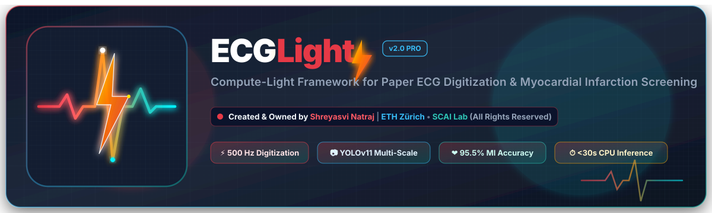
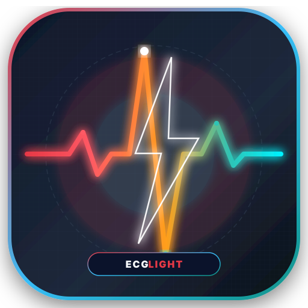
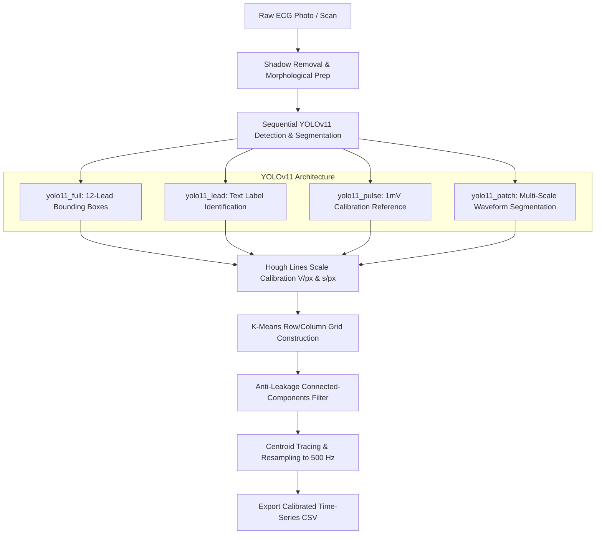
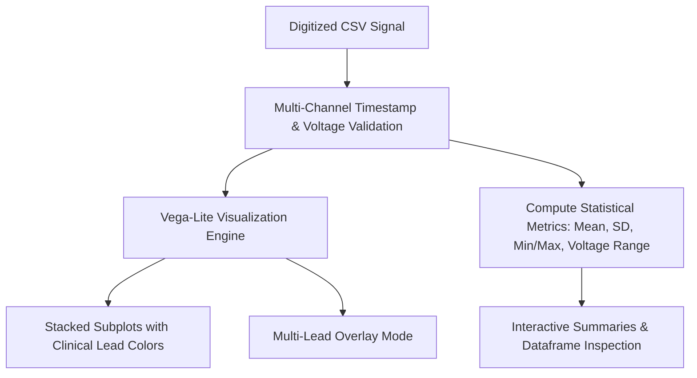
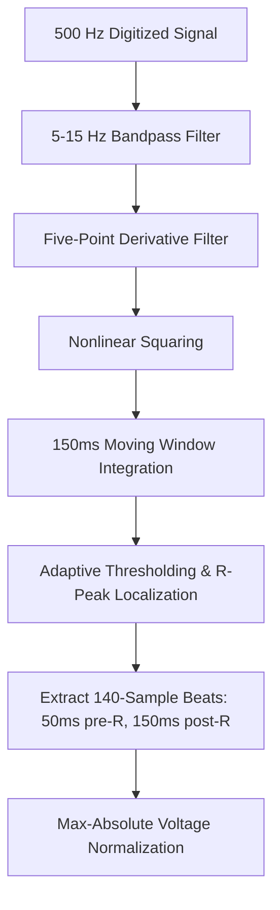
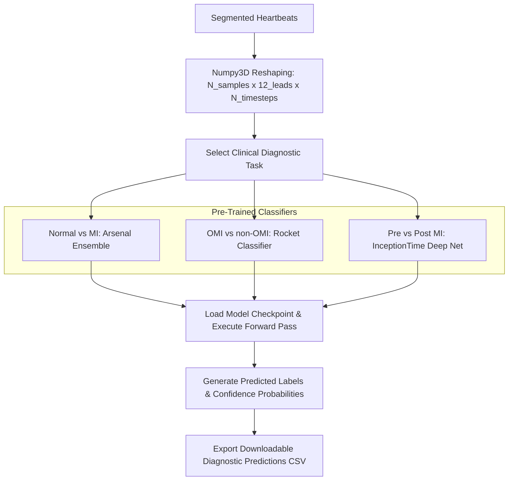

<div align="center">



# ⚡ ECGLight: Compute-Light Framework for Paper ECG Digitization & Cardiac Screening

[](mailto:snatraj@ethz.ch)
[](https://arxiv.org/abs/2607.07683)
[](https://www.python.org/)
[](https://pytorch.org/)
[](https://github.com/ultralytics/ultralytics)
[](#web-dashboard-workstation-overview)
[](#license)

<p align="center">
  <strong>An end-to-end, resource-efficient AI system for high-fidelity paper ECG digitization (500 Hz) and rapid automated screening of Myocardial Infarction (MI) and Occlusive MI (OMI).</strong>
</p>

</div>

---

## 📌 Table of Contents

- [⚡ Project Overview & Key Highlights](#-project-overview--key-highlights)
- [📰 News & Releases](#-news--releases)
- [🖥️ Web Workstation GUI Overview](#️-web-workstation-gui-overview)
- [🚀 Quickstart & Installation](#-quickstart--installation)
  - [Option A: Conda Environment (Recommended)](#option-a-conda-environment-recommended)
  - [Option B: Standard Pip Environment](#option-b-standard-pip-environment)
  - [📥 Downloading Pre-Trained Weights](#-downloading-pre-trained-weights)
- [🧠 Pre-Trained Diagnostic Models](#-pre-trained-diagnostic-models)
- [💻 Python API & Programmatic Usage](#-python-api--programmatic-usage)
- [🛠️ CLI & Batch Pipeline](#️-cli--batch-pipeline)
- [📁 Repository Structure](#-repository-structure)
- [🔬 Scientific Methodology & Architecture](#-scientific-methodology--architecture)
  - [1. Multi-Scale YOLOv11 Digitization](#1-multi-scale-yolov11-digitization)
  - [2. Interactive Signal Analysis](#2-interactive-signal-analysis)
  - [3. Pan-Tompkins Heartbeat Segmentation](#3-pan-tompkins-heartbeat-segmentation)
  - [4. Ensemble & Deep Time-Series Classification](#4-ensemble--deep-time-series-classification)
- [🤝 Collaborating Institutions](#-collaborating-institutions)
- [📄 Citation](#-citation)
- [📄 License](#-license)

---

## ⚡ Project Overview & Key Highlights

**ECGLight** bridges the gap between historical paper electrocardiograms and modern AI diagnostic pipelines. Designed specifically for low-resource clinics, rural healthcare centers, and standard laptop hardware, ECGLight extracts clean, calibrated **500 Hz 12-lead time-series signals** from smartphone photos or flatbed scans in **<30 seconds per ECG on standard CPUs** without requiring cloud servers or expensive GPUs.

```
   ┌───────────────────────┐       ┌──────────────────────┐       ┌────────────────────────┐
   │  📸 Paper ECG Photo   │ ───►  │  ⚡ ECGLight Pipeline │ ───►  │  ❤️ Calibrated 500 Hz  │
   │  (Smartphone / Scan)  │       │  (YOLOv11 + CV Trace)│       │  Signals & MI Decision │
   └───────────────────────┘       └──────────────────────┘       └────────────────────────┘
```

### ✨ Core Capabilities & Benchmark Results

- **📷 High-Fidelity Signal Digitization**: Multi-stage computer vision workflow integrating four sequential YOLOv11 models, Hough transform pulse calibration, K-Means grid reconstruction (3×4, 4×3, 6×2, 12×1 formats), and connected-component anti-leakage filters.
- **❤️ High-Accuracy Cardiac Screening**:
  - **95.51% Accuracy** ($F_1 = 0.9519$) for Myocardial Infarction (MI) detection on the benchmark PTB-XL dataset (21,799 ECGs).
  - **88.89% Accuracy** ($F_1 = 0.8862$) for acute Occlusive MI (OMI) screening on hospital-acquired cohorts.
  - **91.43% Accuracy** ($F_1 = 0.9140$) for pre- vs. post-procedural MI differentiation.
- **⚡ Compute-Light & Ultra-Fast**: Runs natively on standard consumer CPUs (<30s per record) or CUDA GPUs (<4s per record).
- **🖥️ Full Clinical Workstation GUI**: Interactive Streamlit application offering live digitization preview, interactive multi-lead signal exploration, automatic R-peak segmentation, and one-click diagnostic prediction exports.

---

## 📰 News & Releases

- **[2026/07]** 📄 **arXiv Preprint Released**: [*ECGLight: Compute-Light Framework For Paper ECG Digitization and Myocardial Infarction Screening*](https://arxiv.org/abs/2607.07683) (arXiv:2607.07683).
- **[2026/06]** 🚀 **v2.0 Release**: Comprehensive interactive Streamlit Workstation, YOLOv11 multi-scale detector checkpoints, and standalone inference suite.

---

## 🖥️ Web Workstation GUI Overview

The ECGLight workstation provides an interactive, clinical-grade interface:

<div align="center">
  
</div>

1. **📷 Page 1: ECG Image Digitizer**
   - Drag-and-drop paper ECG photos or flatbed scans (`.png`, `.jpg`, `.jpeg`).
   - Real-time pipeline progress reporting: Shadow removal $\rightarrow$ YOLO detection $\rightarrow$ Scale calibration $\rightarrow$ Signal tracing $\rightarrow$ 500 Hz resampling.
   - Live lead preview and automatic time-series CSV export to `output/digitization/latest_digitized.csv`.

2. **📈 Page 2: ECG Signal Viewer**
   - Interactive multi-channel time-series visualizer powered by native Vega-Lite charts.
   - Dual viewing modes: **Stacked Subplots** (color-coded per clinical lead) and **Multi-Lead Overlay**.
   - Client-side zoom, pan, hover tooltips, statistical metrics table (voltage range, mean, SD, min/max), and signal trimming tools.

3. **❤️ Page 3: ECG Classification Engine**
   - Select diagnostic tasks: Normal vs. MI, OMI vs. non-OMI, or Pre vs. Post-procedural MI.
   - Built-in Pan-Tompkins R-peak detector extracts 140-sample normalized beat windows.
   - **Inference Mode**: Generates downloadable diagnostic prediction tables with confidence probabilities.
   - **Evaluation Mode**: Computes Accuracy, $F_1$-Score, Precision, Recall, Specificity, and interactive Confusion Matrices.

---

## 🚀 Quickstart & Installation

### Option A: Conda Environment (Recommended)

```bash
# 1. Clone the repository
git clone https://github.com/scai-lab/ECG-Digitization-Classification.git
cd ECG-Digitization-Classification

# 2. Create and activate the conda environment
conda env create -f environment.yml
conda activate infer

# 3. Launch the Workstation GUI
streamlit run app.py
```

### Option B: Standard Pip Environment

```bash
# 1. Create a virtual environment with Python 3.9 - 3.11
python -m venv venv
source venv/bin/activate    # On Windows: venv\Scripts\activate

# 2. Install dependencies
pip install -r requirements.txt

# 3. Launch the Workstation GUI
streamlit run app.py
```

> [!TIP]
> **Windows TensorFlow Compatibility**:
> If running on Windows and encountering TensorFlow DLL initialization errors, install the pinned pairing:
> ```bash
> pip install tensorflow==2.15.0 protobuf==4.25.3
> ```

---

### 📥 Downloading Pre-Trained Weights

Pre-trained YOLOv11 computer vision models and sktime time-series classifiers are hosted on Polybox:

👉 **[Download Pre-Trained Weights Archive (ETH Zürich Polybox)](https://polybox.ethz.ch/index.php/s/GDACstPtsoTrrWH)**

Extract the archive directly into the project root so the folder structure matches:

```text
models/
├── digitization_models/
│   ├── yolo11_full/weights/best.pt      # Lead bounding box detector
│   ├── yolo11_lead/weights/best.pt      # Lead label OCR classifier (I, II, V1-V6)
│   ├── yolo11_pulse/weights/best.pt     # 1 mV calibration pulse detector
│   └── yolo11_patch/weights/best.pt     # Waveform patch segmentation model
└── classifier_models/
    ├── mi_vs_normal_segmented/          # Arsenal ensemble (Normal vs MI)
    ├── omi_vs_nonomi/                   # Rocket classifier (OMI vs non-OMI)
    └── ecg_surgery/                     # InceptionTime deep net (Pre vs Post MI)
```

---

## 🧠 Pre-Trained Diagnostic Models

| Diagnostic Task | Model Family | Input Tensor Shape | Test Accuracy | F1-Score | Target Endpoint |
| :--- | :--- | :---: | :---: | :---: | :--- |
| **Normal vs. MI (PTB-XL)** | **Arsenal** Ensemble | $12 \times 140$ | **95.51%** | **0.9519** | `MYOCARDIAL_INFARCTION` |
| **Occlusive MI (OMI)** | **Rocket** Classifier | $12 \times 141$ | **88.89%** | **0.8862** | `OMI` |
| **Surgical / Pre vs Post MI** | **InceptionTime** Deep Net | $12 \times 140$ | **91.43%** | **0.9140** | `pre-procedural MI` |

---

## 💻 Python API & Programmatic Usage

You can use the ECGLight core digitization and classification engine directly in Python scripts:

```python
from ultralytics import YOLO
from digitization import ECGImage
from backend import classification_runner
import config

# 1. Load pre-trained YOLOv11 models
model_full = YOLO(config.YOLO_BOX_MODEL_PATH)
model_lead = YOLO(config.YOLO_LEAD_NAME_MODEL_PATH)
model_pulse = YOLO(config.YOLO_PULSE_MODEL_PATH)
model_patch = YOLO(config.YOLO_SEGMENTATION_MODEL_PATH)

# 2. Initialize and execute digitization pipeline
ecg = ECGImage(model_full, model_lead, model_pulse, model_patch, "example_inputs/test.jpg")
ecg.run_full_pipeline()

# 3. Export calibrated 500 Hz time-series CSV
ecg.save_signals_as_csv("output/my_digitized_ecg.csv")
print("Digitization complete! Calibrated signals saved.")
```

---

## 🛠️ CLI & Batch Pipeline

### Batch Digitization (`archive/digitization/run_ecg.py`)

Process structured directories of scanned paper ECGs in batch:

```bash
python archive/digitization/run_ecg.py
```

### Standalone Model Inference (`archive/classification/run_inference.py`)

Run inference on pre-digitized CSV datasets directly from the terminal:

```bash
# 1. Normal vs MI Classification
python archive/classification/run_inference.py --model mi_vs_normal_segmented --input output/digitization/latest_digitized.csv

# 2. Acute Occlusive MI Screening
python archive/classification/run_inference.py --model omi_vs_nonomi --input output/digitization/latest_digitized.csv

# 3. Custom Output Destination
python archive/classification/run_inference.py --model mi_vs_normal_segmented --input my_data.csv --output results/predictions.csv
```

---

## 📁 Repository Structure

```text
.
├── assets/                          # Vector graphics, logos & institutional assets
│   ├── ecglight_banner.svg          # High-resolution ECGLight vector banner
│   ├── ecglight_icon.svg            # Standalone ECGLight vector icon
│   └── scai_lab_logo.svg            # SCAI Lab vector logo
│
├── backend/                         # Asynchronous execution adapters & pipeline runners
│   ├── digitization_runner.py       # YOLO loader, validator, and image processor
│   └── classification_runner.py     # Pan-Tompkins beat segmenter & sktime inference
│
├── utils/                           # Streamlit UI workstation components
│   ├── branding.py                  # Header vector graphics, author card & footer
│   ├── css.py                       # Clinical light theme & micro-animations
│   ├── hardware.py                  # Cached CPU / CUDA GPU detection
│   ├── page_digitizer.py            # Page 1: ECG Image Digitizer view
│   ├── page_csv_viewer.py           # Page 2: Interactive Signal Viewer view
│   └── page_classifier.py           # Page 3: Cardiac Classification view
│
├── models/                          # Pre-trained YOLOv11 & classifier weights
│   ├── digitization_models/         # YOLO checkpoints (full, lead, pulse, patch)
│   └── classifier_models/           # Pre-trained Arsenal, Rocket & InceptionTime models
│
├── app.py                           # Streamlit workstation router & entry point
├── config.py                        # Central configuration registry & author metadata
├── digitization.py                  # Core ECGImage computer vision pipeline
├── environment.yml                  # Conda environment specification
├── requirements.txt                 # Pip dependency specification
├── pyproject.toml                   # Python packaging metadata
├── LICENSE                          # Non-Commercial Academic & Research License
└── README.md                        # Documentation & user guide
```

---

## 🔬 Scientific Methodology & Architecture

### 1. Multi-Scale YOLOv11 Digitization



### 2. Interactive Signal Analysis



### 3. Pan-Tompkins Heartbeat Segmentation



### 4. Ensemble & Deep Time-Series Classification



---

## 🤝 Collaborating Institutions

Developed in multi-center academic and clinical collaboration across Switzerland and Italy:

- [ETH Zürich](https://ethz.ch) — Department of Information Technology and Electrical Engineering (D-ITET)
- [Istituto Cardiocentro Ticino (EOC)](https://www.cardiocentro.org) — Ente Ospedaliero Cantonale
- [Università della Svizzera italiana (USI)](https://www.usi.ch) — Faculty of Biomedical Sciences
- [Università della Campania Luigi Vanvitelli](https://www.unicampania.it) — Department of Advanced Medical and Surgical Sciences

<p align="center">
  <a href="https://ethz.ch" target="_blank">
    
  </a>
  &nbsp;&nbsp;&nbsp;&nbsp;&nbsp;&nbsp;&nbsp;&nbsp;
  <a href="https://www.cardiocentro.org" target="_blank">
    
  </a>
  &nbsp;&nbsp;&nbsp;&nbsp;&nbsp;&nbsp;&nbsp;&nbsp;
  <a href="https://www.usi.ch" target="_blank">
    
  </a>
  &nbsp;&nbsp;&nbsp;&nbsp;&nbsp;&nbsp;&nbsp;&nbsp;
  <a href="https://www.unicampania.it" target="_blank">
    
  </a>
</p>

---

## 📄 Citation

If you use **ECGLight**, its digitization pipeline, or pre-trained models in your research, please cite our arXiv publication:

```bibtex
@article{natraj2026ecglight,
  title={ECGLight: Compute-Light Framework For Paper ECG Digitization and Myocardial Infarction Screening},
  author={Natraj, Shreyasvi and Achtari, Cyrus and Gragnano, Felice and Milzi, Andrea and Valgimigli, Marco and Paez-Granados, Diego},
  journal={arXiv preprint arXiv:2607.07683},
  year={2026},
  url={https://arxiv.org/abs/2607.07683},
  doi={10.48550/arXiv.2607.07683}
}
```

> **APA Reference**:  
> Natraj, S., Achtari, C., Gragnano, F., Milzi, A., Valgimigli, M., & Paez-Granados, D. (2026). ECGLight: Compute-Light Framework For Paper ECG Digitization and Myocardial Infarction Screening. *arXiv preprint arXiv:2607.07683*. https://arxiv.org/abs/2607.07683

---

## 📄 License

**ECGLight** is released under the **Non-Commercial Academic and Research License Agreement**.

- **Author**: Shreyasvi Natraj (ETH Zürich / SCAI Lab)
- **Permitted**: Free for academic research, education, non-commercial clinical studies, and non-profit evaluation.
- **Prohibited**: Any commercial integration, paid clinical diagnostic services, corporate consulting, or proprietary sublicensing without prior written permission.
- Full license terms are available in the [LICENSE](LICENSE) file.

