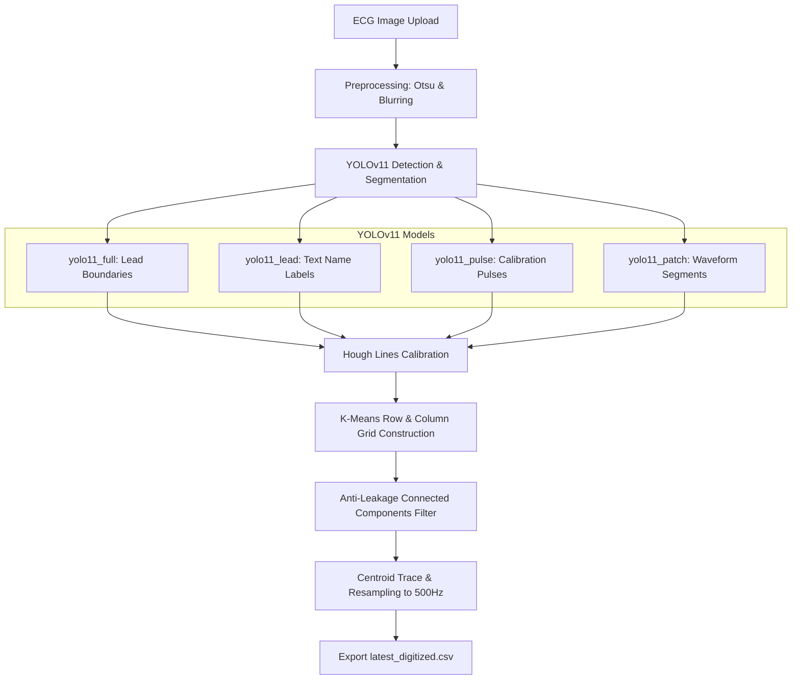
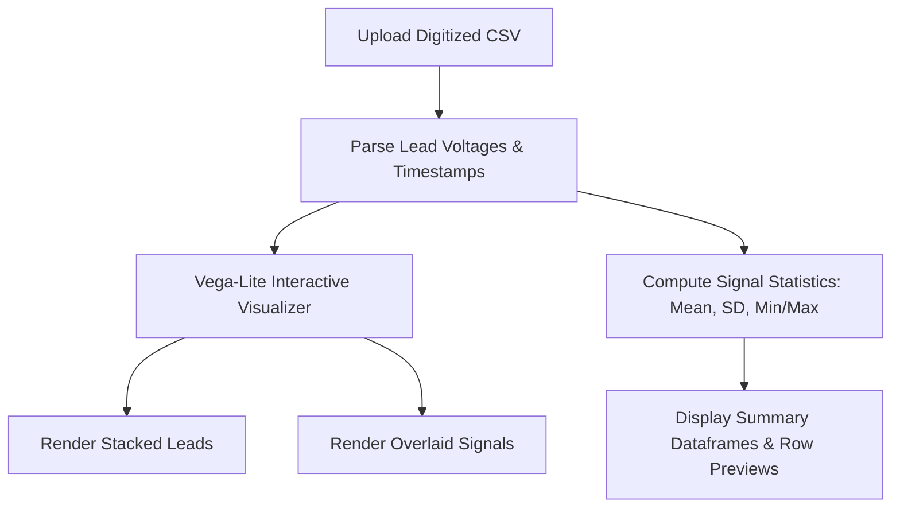
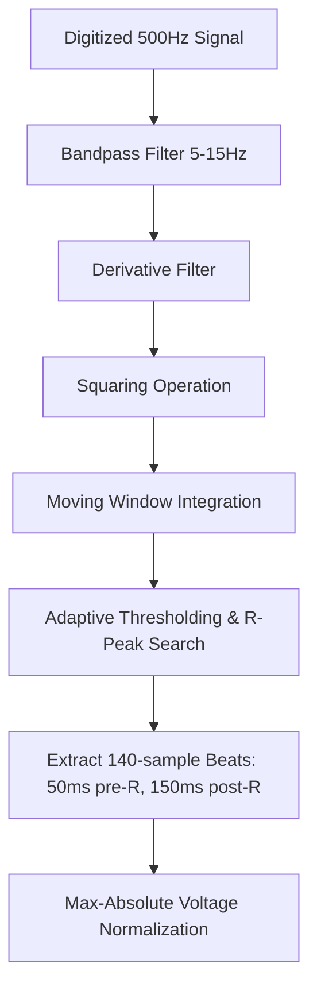
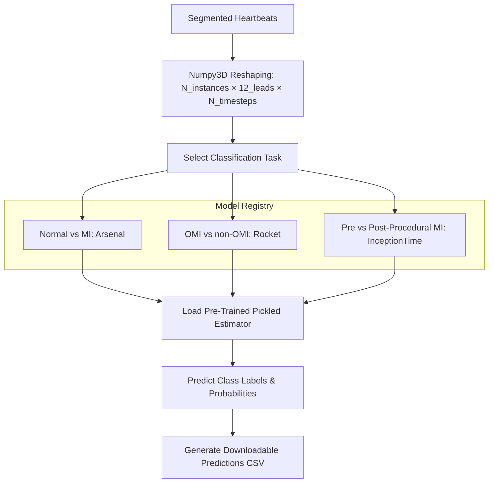

# ⚡ ECGLight: Compute-Light Framework for Paper ECG Digitization & Myocardial Infarction Screening

<div align="center">

[](https://arxiv.org/abs/2607.07683)
[](https://www.python.org/downloads/)
[](https://pytorch.org/)
[](https://github.com/ultralytics/ultralytics)
[](#web-dashboard-workstation-overview)
[](#license)
</div>

---

## <a id="abstract-key-highlights"></a>📌 Abstract & Key Highlights

**ECGLight** is an end-to-end, compute-light framework and interactive web workstation for converting paper/photographed 12-lead ECG records into high-fidelity 500 Hz digitized signals and performing automated screening for Myocardial Infarction (MI) and Occlusive MI (OMI) pathologies.

> 💡 **Designed for Low-Resource & Remote Settings**: ECGLight runs completely on CPU-only hardware in **<30 seconds per ECG** without requiring cloud connectivity or expensive GPU infrastructure, democratizing AI-based decision support for clinics worldwide.

### ✨ Key Features & Capabilities
- **📷 High-Fidelity Signal Digitization**: Multi-stage computer vision pipeline combining sequential YOLOv11 object detection, scale calibration via Hough lines, K-Means grid construction, and an anti-leakage connected-component filter to extract clean 500 Hz 12-lead signals from smartphone photos or scans.
- **❤️ High-Accuracy MI & OMI Screening**:
  - **95.51% Accuracy** ($F_1 = 0.9519$) for MI detection on the benchmark PTB-XL dataset (21,799 ECGs).
  - **88.89% Accuracy** ($F_1 = 0.8862$) for Occlusive MI (OMI) screening on the hospital-acquired ECG-Matrix dataset.
- **⚡ On-Device & Resource-Efficient**: Fully functional on standard consumer laptop CPUs or CUDA GPUs.
- **🖥️ Interactive Web Dashboard Workstation**: Streamlit workstation featuring real-time signal viewing, step-by-step digitization previews, R-peak beat segmentation, and downloadable diagnostic prediction tables.

---

## <a id="news-updates"></a>📰 News & Updates
- **[2026/07]** 📄 Paper released on arXiv: [ECGLight: Compute-Light Framework For Paper ECG Digitization and Myocardial Infarction Screening](https://arxiv.org/abs/2607.07683).
- **[2026/06]** 🚀 Open-source release of the ECGLight web dashboard workstation and pre-trained weights repository.

---

## <a id="table-of-contents"></a>📌 Table of Contents

- [📌 Abstract & Key Highlights](#abstract-key-highlights)
- [📰 News & Updates](#news-updates)
- [🖥️ Web Dashboard Workstation Overview](#web-dashboard-workstation-overview)
- [🚀 Installation & Setup](#installation-setup)
- [🧠 Pre-Trained Classifiers & Tasks](#pre-trained-classifiers-tasks)
- [🚀 Command Line Usage](#command-line-usage)
- [📁 Repository Structure & Directory Organization](#repository-structure-directory-organization)
- [📷 How It Works: Signal Digitization](#how-it-works-signal-digitization)
- [📈 How It Works: Signal Analysis & Visualization](#how-it-works-signal-analysis-visualization)
- [⚡ How It Works: Heartbeat Segmentation](#how-it-works-heartbeat-segmentation)
- [🧠 How It Works: Cardiac Classification](#how-it-works-cardiac-classification)
- [🤝 Collaborating Institutions](#collaborating-institutions)
- [👥 Authors & Contact](#authors-contact)
- [📄 Citation](#citation)
- [📄 License](#license)

---

## <a id="web-dashboard-workstation-overview"></a>🖥️ Web Dashboard Workstation Overview

The ECGLight workstation provides a responsive user interface designed for clinical workflow exploration, research, and education. It unifies the computer vision digitization and diagnostic classification models into a seamless local web application.

### Workstation Modules

1. **📷 ECG Image Digitizer**:
   - Upload scanned or photographed ECG images (`.png`, `.jpg`, `.jpeg`).
   - Execute the sequential YOLOv11 detection pipeline with real-time visual progress indicators.
   - Summarizes detected leads, calibrated sampling rates, and total extracted samples.
   - Automatically exports the digitized time-series CSV to `output/digitization/latest_digitized.csv`.
   
2. **📈 ECG Signal Viewer**:
   - Interactive multi-channel ECG signal visualization using native Streamlit/Vega-Lite charts with zoom, pan, and hover tooltips.
   - Supports stacked subplots (with distinct clinical lead colorings) and multi-lead overlay modes.
   - Computes statistical summaries (mean, SD, min/max, voltage range) and row-level previewing.

3. **❤️ ECG Classification Engine**:
   - Evaluates cardiac pathologies using pre-trained time-series ensemble and deep learning classifiers.
   - Automatically segments raw signals into heartbeats around R-peaks using the Pan-Tompkins algorithm.
   - **Inference Mode (Unlabeled Data)**: Generates downloadable **Predictions Tables** with predicted class labels and probability confidence scores.
   - **Evaluation Mode (Ground-Truth Labeled Data)**: Displays interactive evaluation metrics (Accuracy, $F_1$-Score, Sensitivity, Specificity, Confusion Matrix).

### 🔄 End-to-End Workflow

The pipeline operates in four coordinated phases: **Digitization** $
ightarrow$ **Analysis** $
ightarrow$ **Segmentation** $
ightarrow$ **Classification**. Architectural flowcharts for each phase are provided in the **How It Works** sections below.

---

## <a id="installation-setup"></a>🚀 Installation & Setup

### Prerequisites
- **Python**: `3.9+` (tested on Python 3.9 and 3.11)
- **Hardware**: Standard CPU (CUDA-capable GPU optional, automatically detected)

### Step-by-Step Installation

1. **Clone the Repository**:
   ```bash
   git clone https://github.com/scai-lab/ECG-Digitization-Classification.git
   cd ECG-Digitization-Classification
   ```

2. **Create and Activate Conda Environment**:
   ```bash
   conda env create -f environment.yml
   conda activate infer
   ```

   > [!IMPORTANT]
   > **Windows Compatibility & TensorFlow Setup**:
   > If running on Windows and encountering DLL loading errors (`ImportError: DLL load failed while importing _pywrap_tensorflow_internal`), install the pinned TensorFlow and Protobuf pairing:
   > ```bash
   > pip install tensorflow==2.15.0 protobuf==4.25.3
   > ```

3. **Download Pre-Trained Model Weights**:
   The YOLOv11 detection checkpoints and pre-trained time-series classifiers are hosted on Polybox due to file size constraints:
   
   👉 **[Download Pre-Trained Models Directory (ETH Zürich Polybox)](https://polybox.ethz.ch/index.php/s/GDACstPtsoTrrWH)**
   
   Extract the downloaded archive and place the `models/` directory directly into the root of the project workspace:
   ```text
   models/
   ├── digitization_models/
   │   ├── yolo11_full/weights/best.pt
   │   ├── yolo11_lead/weights/best.pt
   │   ├── yolo11_pulse/weights/best.pt
   │   └── yolo11_patch/weights/best.pt
   └── classifier_models/
       ├── mi_vs_normal_segmented/
       ├── omi_vs_nonomi/
       └── ecg_surgery/
   ```

4. **Launch the Web Dashboard Workstation**:
   ```bash
   streamlit run app.py
   ```

---

## <a id="pre-trained-classifiers-tasks"></a>🧠 Pre-Trained Classifiers & Tasks

The classification engine supports three distinct diagnostic tasks using the pre-trained weights in `models/classifier_models/`:

| Diagnostic Task | Model Architecture | Expected Input Tensor Shape | Test Accuracy | Target Positive Class |
| :--- | :--- | :--- | :---: | :--- |
| **Normal vs Myocardial Infarction (MI)** | **Arsenal** Ensemble | 12 leads $	imes$ 140 timesteps | **92.3%** | `MYOCARDIAL_INFARCTION` |
| **Occlusive MI (OMI) vs Non-OMI** | **Rocket** Classifier | 12 leads $	imes$ 141 timesteps | **88.9%** | `OMI` |
| **Pre-Procedural vs Post-Procedural MI** | **InceptionTime** Deep Net | 12 leads $	imes$ 140 timesteps | **91.4%** | `pre-procedural MI` |

- **Arsenal**: An ensemble of ROCKET classifiers utilizing random convolutional kernels combined with ridge regression feature classification.
- **Rocket**: Random Omni-directional Kernel Extraction classifier computing high-dimensional time-series representations.
- **InceptionTime**: A deep 1D convolutional neural network ensemble leveraging multi-scale temporal kernel convolutions.

---

## <a id="command-line-usage"></a>🚀 Command Line Usage

### Batch Signal Digitization (`run_org.py`)

Process structured directories of paper ECG scans in batch mode:

1. Configure dataset directory paths in `run_org.py`:
   ```python
   ORGANIZED_DIR = "../ecg_files/ECG_organized_all"   # Input dataset root
   OUTPUT_DIR    = "../ecg_files/ECG_digitized"       # Destination for CSVs
   CATEGORIES    = ["pre", "index", "post"]           # Sub-directories
   ```

2. Run the batch digitization script:
   ```bash
   python run_org.py
   ```

### Command-Line Model Inference (`run_inference.py`)

Run standalone inference on pre-digitized CSV datasets:

```bash
# 1. Normal vs MI Classification (Arsenal Model)
python archive/classification/run_inference.py --model mi_vs_normal_segmented --input data/ptb_xl/segmented_heartbeats.csv

# 2. Occlusive MI (OMI) vs Non-OMI Classification (Rocket Model)
python archive/classification/run_inference.py --model omi_vs_nonomi --input data/ecg_matrix_omi_segmented_50_150_90.csv

# 3. Custom Output Destination
python archive/classification/run_inference.py --model ecg_surgery --input data/ecg_surgery_segmented_50_150_70.csv --output results/surgery_preds.csv
```

---

## <a id="repository-structure-directory-organization"></a>📁 Repository Structure & Directory Organization

```
.
├── app.py                          # Streamlit application main router
├── config.py                       # Centralized configuration and model registry
├── digitization.py                 # Core ECGImage extraction pipeline class
├── environment.yml                 # Conda environment dependency specification
├── LICENSE                         # Non-commercial academic license agreement
├── README.md                       # Repository documentation
│
├── backend/                        # Dashboard background execution adapters
│   ├── __init__.py                 # Package initializer
│   ├── digitization_runner.py      # YOLO loader and single-image processor
│   └── classification_runner.py    # Model loader and inference adapter
│
├── utils/                          # Streamlit front-end UI view components
│   ├── __init__.py                 # Package initializer
│   ├── branding.py                 # Header titles and institutional footer logos
│   ├── css.py                      # Custom clinical theme and styling utilities
│   ├── hardware.py                 # Hardware detector (CPU/GPU)
│   ├── page_digitizer.py           # ECG Digitizer page view
│   ├── page_csv_viewer.py          # Interactive Signal Viewer page view
│   └── page_classifier.py          # Classification workstation page view
│
├── models/                         # Relocated YOLO checkpoints and classifiers (external)
│   ├── digitization_models/        # YOLOv11 weights (full, lead, pulse, patch)
│   └── classifier_models/          # Pre-trained classifier weights (Arsenal, Rocket, InceptionTime)
│
└── archive/                        # Archived research, training, and CLI scripts (local)
    └── classification/             # Baseline training and evaluation scripts
```

---

## <a id="how-it-works-signal-digitization"></a>📷 How It Works: Signal Digitization

The core engine in `digitization.py` executes a multi-stage computer vision workflow to convert image pixels into calibrated voltage waveforms:



1. **Image Preprocessing**: Cleans input scans using shadow removal, Otsu binarization, and Gaussian blurring to separate ink traces from paper texture.
2. **YOLO Segmentation**: Applies patched YOLO segmentation models across multiple crop scales (`4×`, `4.5×`, `5×`) to bound individual lead regions.
3. **Multi-Model Object Detection**: Runs YOLO detectors in parallel:
   - `yolo11_full`: Bounding boxes for the 12 lead channels.
   - `yolo11_lead`: Text label identification (I, II, aVR, V1-V6).
   - `yolo11_pulse`: Bounding boxes for 1 mV calibration reference pulses.
4. **Scale Calibration**: Fits Hough lines to calibration pulse boundaries to compute exact voltage scaling ($	ext{V}/	ext{px}$) and time scaling ($	ext{s}/	ext{px}$).
5. **Grid Construction**: Employs K-Means clustering on lead coordinates to construct regular grid layouts (3×4, 4×3, 6×2, 12×1) and resolve standard Cabrera lead ordering.
6. **Contour Tracing & Anti-Leakage Filtering**: Traces pixel centroids, baseline-corrects waveforms, and applies an **anti-leakage connected-component filter** per crop to isolate primary waveform traces from adjacent lead leakage. Signals are resampled to **500 Hz** calibrated in **mV**.

---

## <a id="how-it-works-signal-analysis-visualization"></a>📈 How It Works: Signal Analysis & Visualization



1. **Signal Parsing**: Validates multi-lead CSV headers, timestamps, and sampling consistency.
2. **Interactive Rendering**: Native Vega-Lite charts enable client-side pan, zoom, and multi-channel hover tooltips.
3. **Statistical Profiling**: Calculates lead-level statistical metrics (mean, standard deviation, voltage range, min/max).

---

## <a id="how-it-works-heartbeat-segmentation"></a>⚡ How It Works: Heartbeat Segmentation

Prepares continuous 12-lead signals for classification models via Pan-Tompkins R-peak detection:



1. **Bandpass Filtering**: 5–15 Hz bandpass filter isolates QRS energy while suppressing muscle artifact and baseline wander.
2. **Differentiation & Squaring**: Highlights steep QRS slopes and attenuates P/T waves.
3. **Moving Window Integration**: Integrates energy across a 150 ms window to delineate QRS complexes.
4. **Adaptive Thresholding**: Dynamically searches for R-peak maxima.
5. **Beat Windowing & Normalization**: Extracts beat windows centered around R-peaks (50 ms pre-R, 150 ms post-R), normalizes max-absolute voltage, and formats output tensors (140/141 timesteps).

---

## <a id="how-it-works-cardiac-classification"></a>🧠 How It Works: Cardiac Classification



1. **Tensor Formatting**: Formats heartbeat segments into 3D NumPy arrays `(N_samples, 12_leads, N_timesteps)`.
2. **Model Evaluation**: Invokes the pre-trained pickled estimator for the selected diagnostic endpoint.
3. **Report Generation**: Formats class predictions, confidence probabilities, and diagnostic metrics for export.

---

## <a id="collaborating-institutions"></a>🤝 Collaborating Institutions

This research project was developed in multi-center academic and clinical collaboration:

- [ETH Zürich](https://ethz.ch)
- [Istituto Cardiocentro Ticino (EOC)](https://www.cardiocentro.org)
- [Università della Svizzera italiana (USI)](https://www.usi.ch)
- [Università della Campania Luigi Vanvitelli](https://www.unicampania.it)

<p align="center">
  <a href="https://ethz.ch" target="_blank">
    
  </a>
  &nbsp;&nbsp;&nbsp;&nbsp;&nbsp;&nbsp;&nbsp;&nbsp;
  <a href="https://www.cardiocentro.org" target="_blank">
    
  </a>
  &nbsp;&nbsp;&nbsp;&nbsp;&nbsp;&nbsp;&nbsp;&nbsp;
  <a href="https://www.usi.ch" target="_blank">
    
  </a>
  &nbsp;&nbsp;&nbsp;&nbsp;&nbsp;&nbsp;&nbsp;&nbsp;
  <a href="https://www.unicampania.it" target="_blank">
    
  </a>
</p>

---

## <a id="authors-contact"></a>👥 Authors & Contact

- **Shreyasvi Natraj** — [snatraj@ethz.ch](mailto:snatraj@ethz.ch)
- **Cyrus Achtari**
- **Felice Gragnano**
- **Andrea Milzi**
- **Marco Valgimigli**
- **Diego Paez-Granados**

---

## <a id="citation"></a>📄 Citation

If you use **ECGLight** or its pre-trained models in your research, please cite our arXiv preprint:

```bibtex
@article{natraj2026ecglight,
  title={ECGLight: Compute-Light Framework For Paper ECG Digitization and Myocardial Infarction Screening},
  author={Natraj, Shreyasvi and Achtari, Cyrus and Gragnano, Felice and Milzi, Andrea and Valgimigli, Marco and Paez-Granados, Diego},
  journal={arXiv preprint arXiv:2607.07683},
  year={2026},
  url={https://arxiv.org/abs/2607.07683},
  doi={10.48550/arXiv.2607.07683}
}
```

> **APA Citation**:
> Natraj, S., Achtari, C., Gragnano, F., Milzi, A., Valgimigli, M., & Paez-Granados, D. (2026). ECGLight: Compute-Light Framework For Paper ECG Digitization and Myocardial Infarction Screening. *arXiv preprint arXiv:2607.07683*. https://arxiv.org/abs/2607.07683

---

## <a id="license"></a>📄 License

This repository and model weights are released under the **Non-Commercial Academic and Research License Agreement**. Please refer to the [LICENSE](LICENSE) file for full terms. Free for non-profit academic and research use. Commercial use is strictly prohibited.
