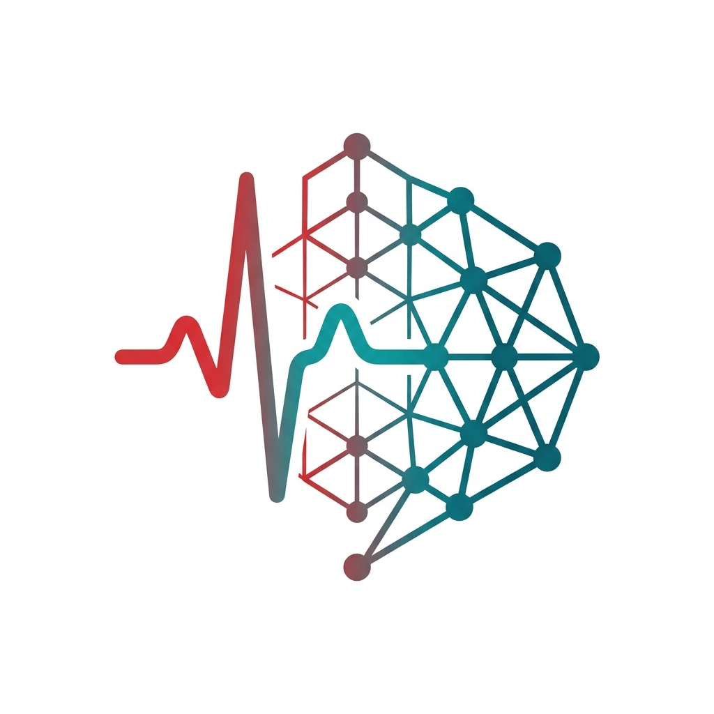
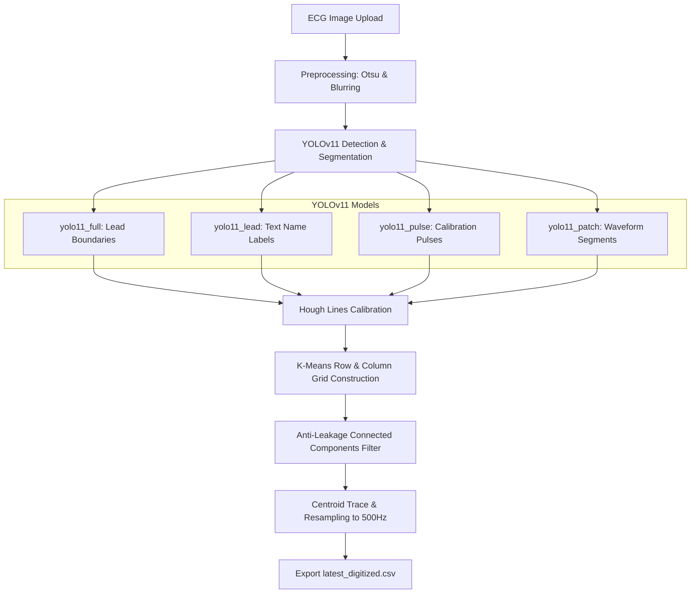
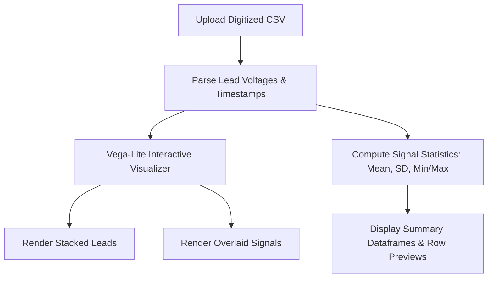
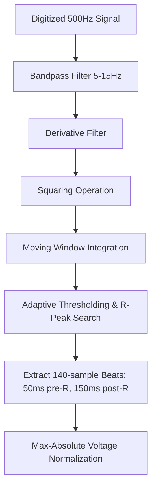
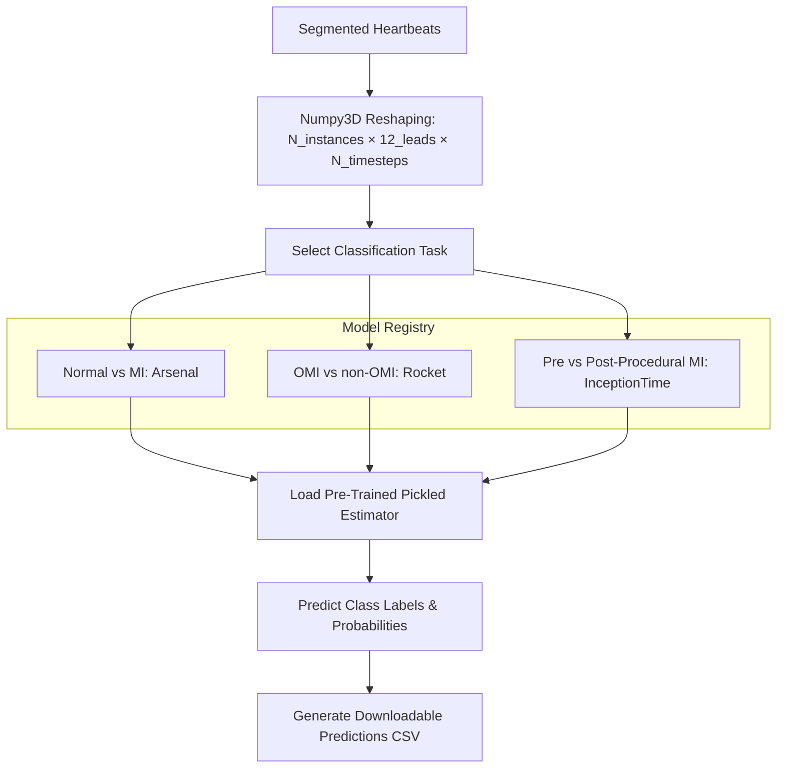

# ⚡ ECG Digitization & Classification Dashboard

<table align="center" border="0" style="border-collapse: collapse; border: none;">
  <tr style="border: none;">
    <td align="center" valign="middle" style="border: none; padding-right: 40px;">
      
    </td>
    <td align="center" valign="middle" style="border: none;">
      
    </td>
  </tr>
</table>

An advanced, interactive Streamlit web workstation designed to convert printed/photographed 12-lead paper ECG reports into high-resolution digitized signals and carry out different types of classification over them. The suite is engineered to run with low computational resource requirements, operating seamlessly on a standard consumer laptop GPU (via CUDA) or running completely on CPU.

---

## 🖥️ Web Dashboard Workstation Overview

The dashboard provides a premium, responsive user interface designed for research, education, and clinical workflow exploration. It coordinates the digitization and classification pipelines into a unified, lightweight web application.

### Workstation Modules

1. **📷 ECG Image Digitizer**:
   - Upload any scanned or photographed ECG image (`.png`, `.jpg`, `.jpeg`).
   - Run the sequential YOLOv11 pipeline step-by-step with real-time progress indicators.
   - Outputs a summary of detected leads and total samples.
   - Automatically saves the digitized CSV to disk under `output/digitization/latest_digitized.csv` for downstream consumption.
   
2. **📈 ECG Signal Viewer**:
   - Visualizes multi-channel ECG signals interactively using client-side native Streamlit line charts (supporting zoom, pan, and hover tooltips).
   - Supports stacked subplots (with distinct clinical colors for each lead: clinical red, teal, deep blue, yellow, purple, etc.) or overlaid graphs.
   - Displays statistical summaries (mean, standard deviation, min/max, range) and allows row-by-row signal previewing.

3. **❤️ ECG Classification**:
   - Predicts cardiac conditions using pre-trained ensemble and deep learning classifiers.
   - Automatically segments raw signals into heartbeats around R-peaks using the Pan-Tompkins algorithm before running inference.
   - **Inference Mode (No Ground-Truth)**: If the uploaded CSV lacks diagnostic labels, the dashboard displays a downloadable **Predictions Table** detailing predicted class diagnoses and model confidence probabilities.
   - **Evaluation Mode (With Ground-Truth)**: If labels are present, the page calculates and plots performance metrics (Accuracy, F1-Score, Sensitivity, Specificity, Confusion Matrix).

### 🔄 Workflow

The workstation coordinates the pipeline through four distinct steps: **Digitization**, **Analysis**, **Segmentation**, and **Classification**. The technical workflows for each process are documented below in their respective **How It Works** sections.

---

## 📁 Repository Structure & Directory Organization

The repository is structured to maintain a clean root directory, moving utility runners, UI views, model checkpoints, and legacy/training scripts into distinct modules:

```
.
├── app.py                          # Streamlit application main router
├── config.py                       # Centralized configuration and model registry
├── digitization.py                 # Core ECGImage extraction pipeline class
├── environment.yml                 # Conda environment dependency file
├── README.md                       # Comprehensive repository documentation
│
├── backend/                        # Dashboard background execution adapters
│   ├── __init__.py                 # Backend package declaration
│   ├── digitization_runner.py      # YOLO loader and single-image processor
│   └── classification_runner.py    # Pre-trained model loader and preprocessor
│
├── utils/                          # Streamlit front-end page components
│   ├── __init__.py                 # Utils package declaration
│   ├── branding.py                 # Sidebar titles, headers, and footer logos
│   ├── css.py                      # Custom clinical theme and grid background CSS
│   ├── hardware.py                 # Displays CPU/GPU hardware properties (cached)
│   ├── page_digitizer.py           # Front-end for the ECG Digitizer page
│   ├── page_csv_viewer.py          # Front-end for the interactive Signal Viewer
│   └── page_classifier.py          # Front-end for the Classification workstation
│
├── models/                         # Relocated YOLO checkpoints and classifiers
│   ├── digitization_models/        # YOLO v11 checkpoints for digitization
│   │   ├── yolo11_full/            # YOLO Bounding boxes
│   │   ├── yolo11_lead/            # YOLO Lead names
│   │   ├── yolo11_pulse/           # YOLO Reference pulses
│   │   └── yolo11_patch/           # YOLO Waveform segmentations
│   │
│   └── classifier_models/          # Bundled pre-trained diagnostic classifiers
│       ├── mi_vs_normal_segmented/ # Pre-trained Arsenal model (segmented beats)
│       ├── omi_vs_nonomi/          # Pre-trained Rocket model (segmented beats)
│       └── ecg_surgery/            # Pre-trained InceptionTime model (segmented beats)
│
└── archive/                        # Archived developer, training, and legacy scripts
    └── classification/             
        ├── train_and_save_models.py# Script used to compile pre-trained models
        ├── run_inference.py        # Independent CLI inference execution script
        ├── run_classification.py   # Baseline MLP classifier pipeline
        ├── run_benchmarking.py     # Comparison benchmarking suite
        ├── run_lead_importance_test.py# Individual lead performance evaluator
        ├── feature_analysis.py     # Original all-in-one analysis script
        ├── aggregate_subject_metrics.py# Multi-subject performance aggregator
        ├── dataset_curate.py       # Local dataset curation utility
        └── re_plotter.py           # Advanced Gaussian signal generator & visualizer
```

---

## 🚀 Installation & Setup

### Prerequisites
- Python 3.9
- CUDA-capable GPU recommended (automatically falls back to CPU if unavailable).

### Conda Environment & Model Setup

1. Clone the repository and navigate to the project directory:
   ```bash
   git clone https://github.com/scai-lab/ECG-Digitization-Classification.git
   cd ECG-Digitization-Classification
   ```

2. Create the conda environment using the provided `environment.yml` configuration:
   ```bash
   conda env create -f environment.yml
   conda activate infer
   ```

   > [!IMPORTANT]
   > **Windows Compatibility & TensorFlow Setup**:
   > If you are on Windows and encounter native runtime loading failures (`ImportError: DLL load failed while importing _pywrap_tensorflow_internal: A dynamic link library (DLL) initialization routine failed`), you need to install a stable version pairing of TensorFlow and Protobuf:
   > ```bash
   > pip install tensorflow==2.15.0 protobuf==4.25.3
   > ```
   > *(Make sure no background Streamlit or Python tasks are running when executing this command, to prevent file locking issues on `.pyd` libraries).*

3. **Download Pre-Trained Model Weights**:
   Due to their file sizes, the YOLO detection checkpoints and pre-trained classifiers are hosted externally. Download the `models/` directory from the link below and place it directly in the root of the project:
   
   👉 **[Download Pre-Trained Models Directory (ETH Zürich Polybox)](https://polybox.ethz.ch/index.php/s/GDACstPtsoTrrWH)**
   
   Once extracted, verify that the weights are located inside the directory tree structure:
   ```text
   models/
   ├── digitization_models/
   │   ├── yolo11_full/weights/best.pt
   │   ├── yolo11_lead/weights/best.pt
   │   ├── yolo11_pulse/weights/best.pt
   │   └── yolo11_patch/weights/best.pt
   └── classifier_models/
       ├── mi_vs_normal_segmented/
       ├── omi_vs_nonomi/
       └── ecg_surgery/
   ```

Key packages installed by the environment: `torch 2.7`, `ultralytics 8.3`, `opencv-python 4.11`, `scikit-image 0.24`, `wfdb 4.3`, `patched-yolo-infer 1.3.8`, `sktime`, `streamlit`.

---

## 🧠 Pre-Trained Classifiers & Tasks

The classification engine supports three diagnostic tasks using the pre-trained weights in `classifier_models/`:

| Classification Task | Model Type | Expected Input Shape | Test Accuracy | Positive Class |
| :--- | :--- | :--- | :---: | :--- |
| **Normal vs Myocardial Infarction (MI) - Segmented** | Arsenal | 12 leads × 140 timesteps | **92.3%** | `MYOCARDIAL_INFARCTION` |
| **Occlusive MI (OMI) vs non-OMI** | Rocket | 12 leads × 141 timesteps | **88.9%** | `OMI` |
| **Pre-Procedural vs Post-Procedural MI** | InceptionTime | 12 leads × 140 timesteps | **91.4%** | `pre-procedural MI` |

- **Arsenal**: An ensemble of ROCKET classifiers utilizing random convolutional kernels to extract feature representations combined with ridge regression.
- **Rocket**: Random Omni-directional Kernel Extraction (ROCKET) classifier, computing kernel convolutions quickly for high-dimensional time-series data.
- **InceptionTime**: A deep convolutional network ensemble modeled on the Inception architecture, extracting multi-scale temporal features.

---

## 📷 How It Works: Signal Digitization

The core class [digitization.py](file:///d:/Projects/ECG-Digitize-Classify-Demo/digitization.py) operates a multi-stage sequential computer vision pipeline to translate raster images into digitized signals:



1. **Preprocessing**: Cleans the scanned image using shadow-removal masks, Otsu binarization, and Gaussian blurring to isolate ink lines from paper textures.
2. **YOLO Segmentation**: Applies a patched YOLO segmentation model at three crop scales (`4×`, `4.5×`, and `5×` height) to isolate individual lead waveform contours.
3. **Sequential Detections**: Runs three YOLO models in parallel:
   - `yolo11_full`: Bounding boxes for the 12 lead channels.
   - `yolo11_lead`: Text labels representing lead names (I, II, aVR...).
   - `yolo11_pulse`: Bounding boxes for the calibration reference pulses (typically 1mV high, representing vertical scale).
4. **Scale Calibration**: Fits Hough lines to the calibration pulse boundaries. The pixel height determines the voltage scale (`volt/pixel`), while the width determines the time scale (`time/pixel`).
5. **Grid Construction**: Employs K-Means clustering on lead coordinates to map rows and columns, automatically parsing standard Cabrera orders and grid formats (3×4, 4×3, 6×2, 12×1).
6. **Signal Extraction & Post-Processing**: Traces contours to extract raw pixel centroids, performs baseline correction, applies linear interpolation to bridge gaps, and resamples to a standard **500 Hz** frequency calibrated in **millivolts (mV)**. In addition, an **anti-leakage component filter** is executed per cell crop using connected components analysis to automatically identify the primary waveform trace and strip out smaller, boundary-adjacent components (leaked signals from neighboring leads) that sit far from the row baseline.

---

## 📈 How It Works: Signal Analysis & Visualization

Once continuous signals are extracted, the dashboard runs analytical tasks and displays interactive previews:



1. **Parse Signals**: Reads digitized CSV format, validating lead names and timestamps.
2. **Vega-Lite Visualization**: Renders interactive charts supporting native client-side zoom, pan, and hover tooltips for all channels.
3. **Signal Statistics**: Automatically computes statistical characteristics (mean, standard deviation, min/max values) for each lead.

---

## ⚡ How It Works: Heartbeat Segmentation

To prepare continuous digitized signals for the classification models, the pipeline runs the Pan-Tompkins R-peak detection algorithm:



1. **Filtering**: The Lead II signal is filtered via a bandpass filter (5-15 Hz) to suppress muscle noise, baseline wander, and T-wave interference.
2. **Differentiation**: Computes the slope of the signal to highlight the rapid change in the QRS complex.
3. **Squaring**: Performs point-by-point squaring to amplify QRS slopes while attenuating smaller waves.
4. **Integration**: A moving window integrator (typically 150ms wide) compiles the slope information into a peak window.
5. **Adaptive Thresholding & Peak Search**: Dynamically computes threshold constants based on average noise and signal levels, locating R-peaks.
6. **Beat Windowing**: Extracts a localized heartbeat around each R-peak (typically extending 50ms before and 150ms after the peak), normalizes the voltage per heartbeat using max-absolute scaling, and truncates/pads the resulting segments to the target model input width (e.g. 140 or 141 timesteps).

---

## 🧠 How It Works: Cardiac Classification

The heartbeat segment tensors are evaluated using pre-trained time-series classification models:



1. **Numpy3D Formatting**: Formats the heartbeat segments into a standard `sktime` `Numpy3D` tensor with shape `(N_instances, 12_leads, N_timesteps)`.
2. **Dynamic Task Selection**: Loads the pre-trained pickled model corresponding to the selected classification task.
3. **Model Inference**: Evaluates the model to compute class predictions and probability confidences.
4. **Result Generation**: Automatically builds downloadable prediction tables and calculates performance metrics if ground-truth labels are present in the dataset.

---

## 🚀 Command Line Usage

### Run Batch Digitization (`run_org.py`)

The batch processing script processes nested hospital directories, exporting structured folders of digitized CSVs:

1. Configure path variables at the top of `run_org.py`:
   ```python
   ORGANIZED_DIR = "../ecg_files/ECG_organized_all"   # Input dataset root
   OUTPUT_DIR    = "../ecg_files/ECG_digitized"       # Mirrored CSV directory
   CATEGORIES    = ["pre", "index", "post"]           # Categories to process
   ```

2. Run the script:
   ```bash
   python run_org.py
   ```

### Run Model Inference (`run_inference.py`)

Execute predictions directly on digitized data from the command line using `run_inference.py` located in `archive/classification/`:

```bash
# MI vs Normal Segmented heartbeat classification
python archive/classification/run_inference.py --model mi_vs_normal_segmented --input data/ptb_xl/segmented_heartbeats.csv

# OMI vs non-OMI classification
python archive/classification/run_inference.py --model omi_vs_nonomi --input data/ecg_matrix_omi_segmented_50_150_90.csv

# Custom output file path
python archive/classification/run_inference.py --model ecg_surgery --input data/ecg_surgery_segmented_50_150_70.csv --output results/surgery_preds.csv
```

---

## 🤝 Collaborating Institutions

This project was developed in collaboration with:

<p align="center">
  
  &nbsp;&nbsp;&nbsp;&nbsp;&nbsp;&nbsp;&nbsp;&nbsp;
  
  &nbsp;&nbsp;&nbsp;&nbsp;&nbsp;&nbsp;&nbsp;&nbsp;
  
</p>

---

## 👥 Authors & Contact

- **Shreyasvi Natraj** — [snatraj@ethz.ch](mailto:snatraj@ethz.ch)
- **Cyrus Achtari**

---

## 📄 License

This project is released under the **Non-Commercial Academic and Research License Agreement**. Please refer to the [LICENSE](file:///d:/Projects/ECG-Digitize-Classify-Demo/LICENSE) file in the repository root for the full licensing terms. The codebase and trained model weights are provided free of charge for personal, academic, and non-profit research use only. Commercial use is strictly prohibited.
